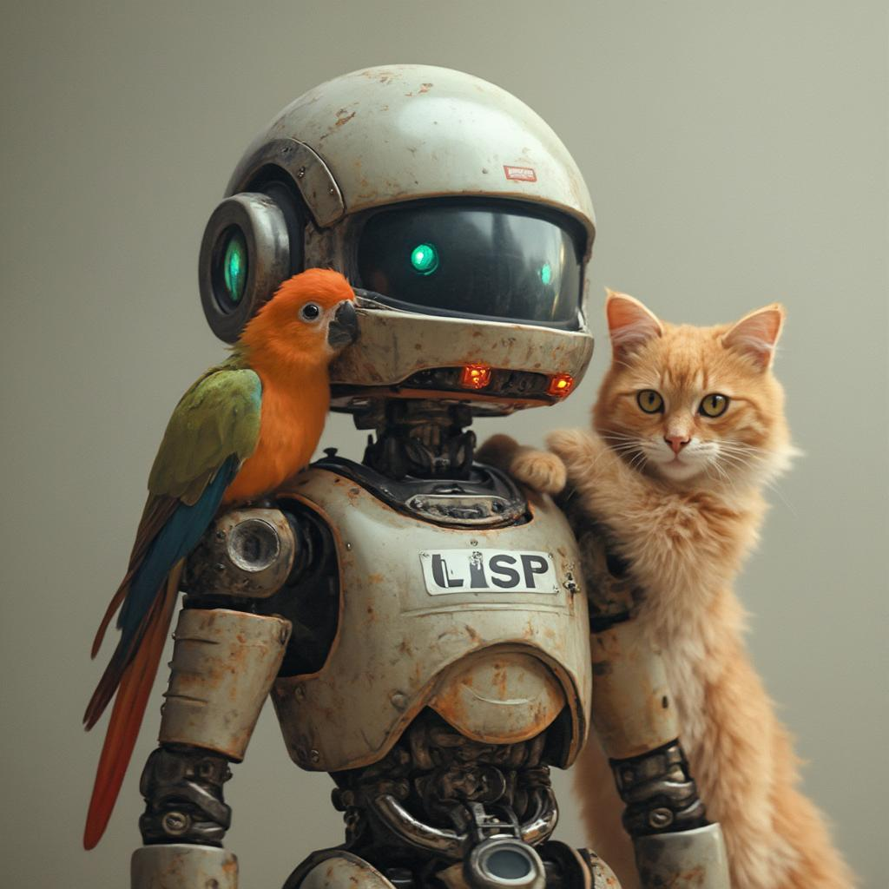

# Hylang ML Examples

> "Code is Data, Data is Code" — The Lisp Way

A collection (**just beginning to fill up**) of examples showcasing Hy (a Lisp dialect embedded in Python) for machine learning tasks.

## About

**My goal is not to showcase code cluttered with parentheses, but rather to demonstrate code that is highly readable (though this might not be immediately obvious to those unfamiliar with LISP syntax). And code that remains concise at the same time.**

This repository demonstrates the power and elegance of Hy - a Lisp dialect embedded in Python - applied to machine learning problems. Hy combines the best of both worlds: the expressiveness and metaprogramming capabilities of Lisp with Python's rich machine learning ecosystem.

## Why Lisp for Machine Learning?

The Lisp family of languages offers unique advantages for developing ML systems:

- **Homoiconicity**: Code and data share the same representation, making metaprogramming natural and powerful
- **Macros**: Enable creation of specialized DSLs for ML tasks
- **Functional Approach**: Simplifies data manipulation and pipeline construction
- **Interactive Development**: REPL-driven development is perfect for exploratory data analysis
- **Expression-Oriented**: Everything is an expression, leading to more concise and composable code

## Why Hy?

- Full compatibility with Python's ecosystem (numpy, pandas, scikit-learn, pytorch, etc.)
- All the power of Lisp without losing access to Python's vast library collection
- Seamless integration with Jupyter notebooks
- Easy embedding into existing Python projects
- Zero-cost abstractions when compiled to Python bytecode

<!--
## Project Structure

```
hylang-ml-examples/
├── diffusers/
├── yolo/
``` -->

## Examples

### Data Pipeline with Threading Macro

```hy
(defn preprocess-data [data]
  (-> data
      (normalize-features)
      (select-features ["age" "income" "category"])
      (handle-missing)
      (encode-categorical)))
```

```hy
(as-> (pipe
       :prompt "Ukrainian girl with parrot on her shoulder and fluffy rufous cat"
       :width 1024
       :height 1024
       :num_inference_steps 30
       :guidance_scale 3.5) it
  it.images
  (get it 0)
  (.save it f"flux-text-to-image-{(time):.0f}.jpg"))
```

### Network stream processing: person detection with YOLO classification model

```hy
(defn read-device-and-process-frame [cap]
  (let [#(success? frame) (cap.read)]
    (when success?
      (process frame))))

(defn process [frame]
  (let [first-result (-> (model.predict frame :verbose False)
                         first
                         .cpu)
        top1-class-index first-result.probs.top1
        top1conf (first-result.probs.top1conf.item)
        person-class? (= top1-class-index person-class-index)
        confidence-threshold-passed? (> top1conf person-confidence-threshold)
        person-detected? (and person-class? confidence-threshold-passed?)]
    (if person-detected?
      (cv2.imshow "Person detected!" frame)
      (cv2.imshow "No events..." frame))
    (cv2.waitKey 1)))

(while True
  (let [capture-device (cv2.VideoCapture video-source)]
    (while (read-device-and-process-frame capture-device)
      (continue))
    (print "End of stream or file. Reopening/reconnecting")))
```

### Other macros example

```hy
(doto pipe
  (.fuse_lora :lora_scale 0.95)
  (.text_encoder.to "cuda")
  (.vae.to "cuda")
  (.vae.enable_slicing)
  (.vae.enable_tiling))
```

## Getting Started

1. Create virtual environment. For example with Conda:

```bash
conda create --name <my-env>
```

2. Install main dependencies:

```bash
pip install hy hyrule
```

Install other dependencies what you want:

```bash
pip diffusers ultralytics cv2 ...
```

3. Install Pytorch by instructions at https://pytorch.org/ For example:

```bash
pip install torch torchvision torchaudio --index-url https://download.pytorch.org/whl/cu124
```

4. Clone the repository:

```bash
git clone https://github.com/KMiNT21/hylang-ml-examples.git
cd hylang-ml-examples
```

## Contributing

I welcome your contributions!

 
---

*"In Lisp, you don't just write your program; your program writes your program"*

**Note**: This project is meant for both educational purposes and practical applications. It demonstrates how functional programming patterns and Lisp's unique features can bring clarity and power to machine learning code.